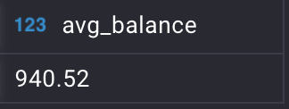
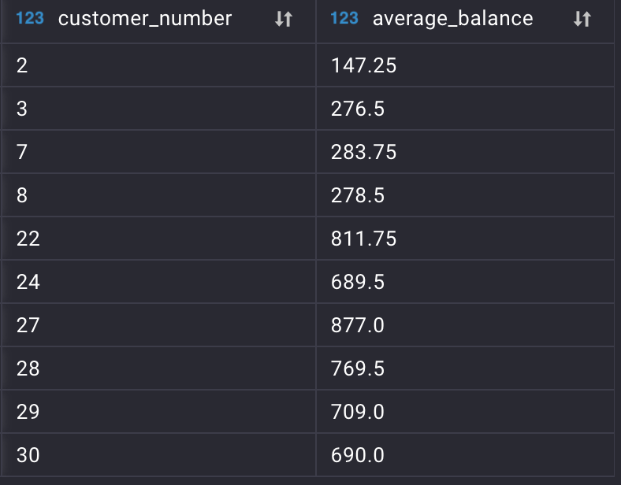
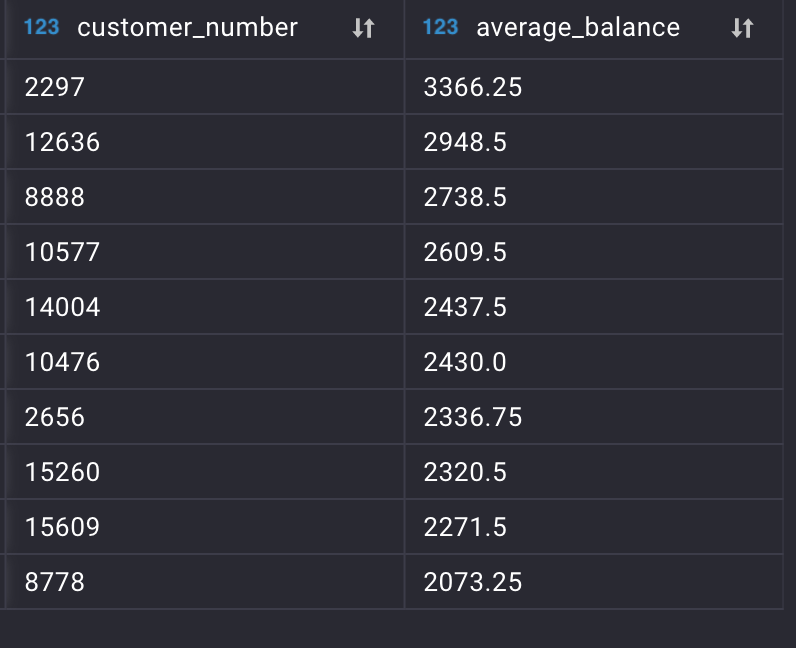
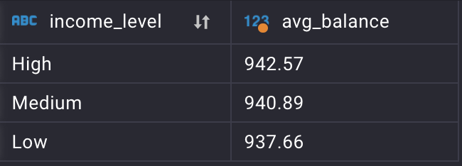
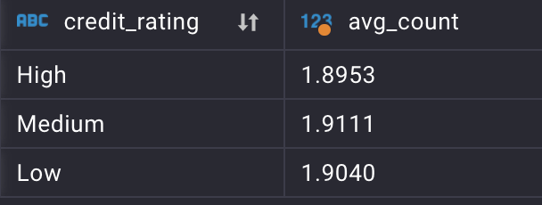
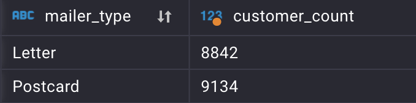
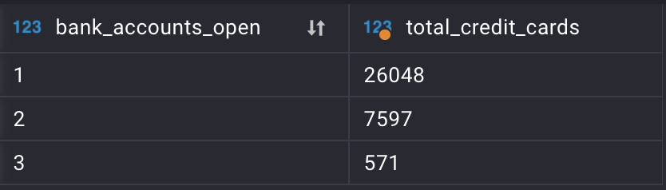

 # **Some useful SQL statistics**
 
 - Average balance of all customers:
 

 
 
- Top 10 customers below average balance:

- Highest average balances

- Average balance by Income Level

- Average balance by credit rating

- Average balance differnce between high and low credit rating

- Average balance by mailer type

- Offer acceptance count

- Correlation between credit card count of customers and opened bank accounts of customers
 
 

