  ## **Tableau-Classification questions and answers**
  
  **Notes**:
  - To see my Tableau work,plese see (https://public.tableau.com/app/profile/aysel.rasulova)
  - Original data was cleaned and imported to another excel file to work on Tableau
  
  
  **Question 1**:

1. Convert the necessary measures to dimensions (the variables that are categorical in nature)

**Credit cards hold,Homes owned,Bank accounts open,Household size** columns are converted to dimension.

**Average balance,Q1 balance,Q2 balance,Q3 balance and Q4 balance** columns are converted to continious

 **Question 2**:
 
 Check the imbalance in the dataset by looking at the number of people who accepted the offer vs. people who did not accept the offer. Add the counts as labels on the plots

 **Question 3**:
 
 Do a quick table calculation on the previous plot to check percentage of total for both yes and no
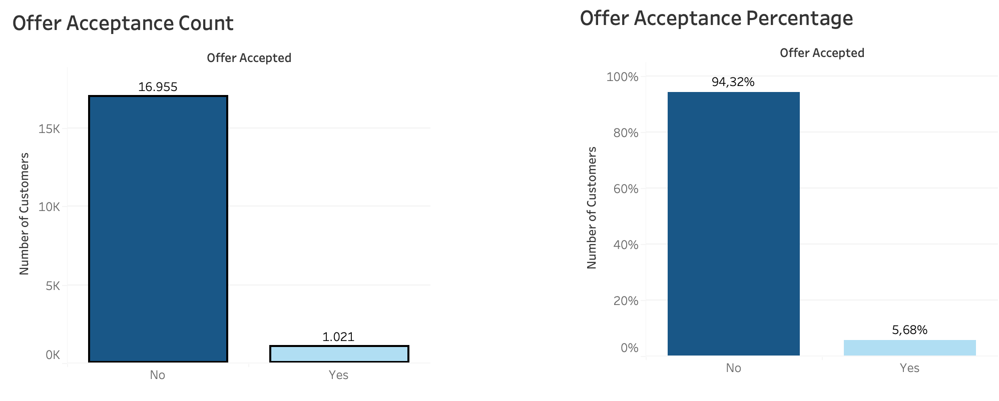

 **Question 4**:
 
 Now we will try to analyze certain characteristics / the differences between the people who accepted the offer vs people who did not accept the offer. Use different sheets for each of the plots below.

- Plot average Q1 balance vs Offer Accepted. Provide the values of averages as labels.
- Plot average Q2 balance vs Offer Accepted. Provide the values of averages as labels.
- Plot average Q3 balance vs Offer Accepted. Provide the values of averages as labels.
- Plot average Q4 balance vs Offer Accepted. Provide the values of averages as labels.

You used different sheets to create the individual plots mentioned before. Now we want to see all the four plots together on the same sheet. The plots should have the same detail as before. Do you observe any trend here?

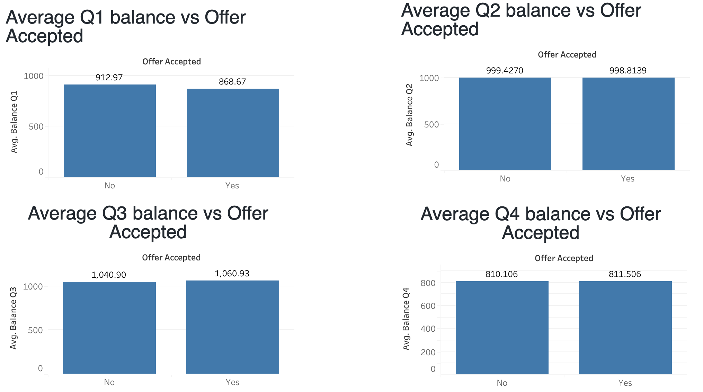

**Output**:
Both the customers who accepted and rejected offer have the least balance at the end of year(Q4)

 **Question 5**:
 
 Now for all the plots, change the style of the plot from bar chart to a line chart. Do you think it improves the visibility of the data
 
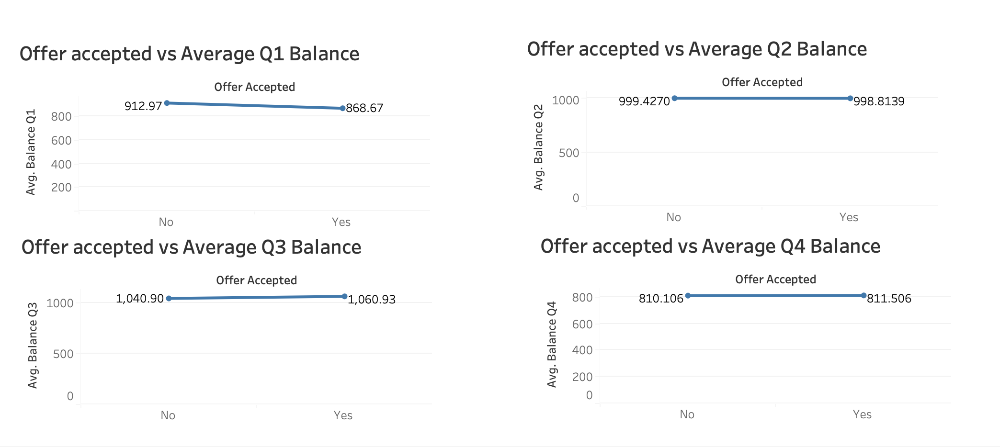

**Output**:
With line chart it is more obvious that the difference between accepted and rejected customers was maximum in first quarter(Q1)

 **Question 6**:
 
 Consider a similar analysis for Household Size vs average balances for each quarter. You would observe a huge jump in average balance from Q1 to Q2 for households  with size 8

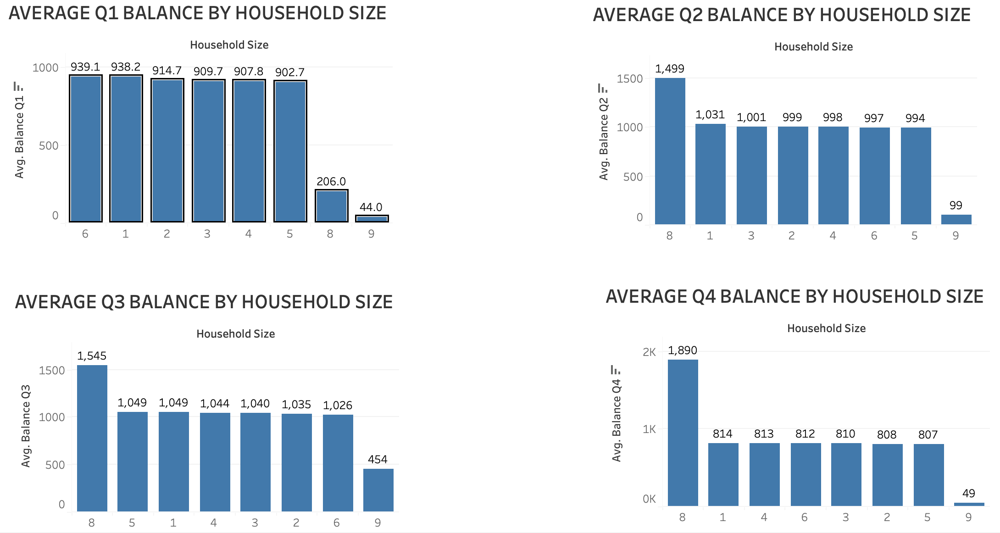

Try and explain that jump. Hint: Check the number of records we have for such customers. Do you see any anomaly?

**Output**:

Yes,there is definitely anomaly.Because for the household size of 8,206 average balance seems not real.Most probably it is an outlier.

 **Question 7**:
 
 Now we want to see how some of the other features In the data might have affected responses from the people. For these we will first start by creating a cross tab. A cross tab is simply a table between two categorical features with some metric of importance filling up the table

- Create a cross tab between Offer Accepted and Overdraft Protection and fill the table with number of records. Do you observe any trend here?
- Create a cross tab between Offer Accepted and Mailer Type and fill the table with number of records. Do you observe any trend here?
- Create a cross tab between Offer Accepted and Credit Rating and fill the table with number of records. Rearrange the column credit rating from low to high. Do you observe any trend here?

 **Output**:
 
 **Few people have overdraft protection and few people accept the offer.Overdraft Protection doesnt have influence on acceptance**

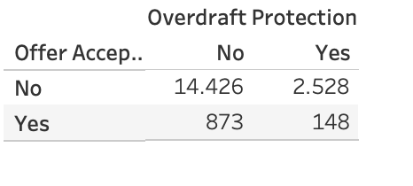

**Postcard mailers have much greater acceptance**

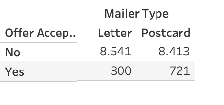

**Credit Rating have negativ corelation with acceptance**

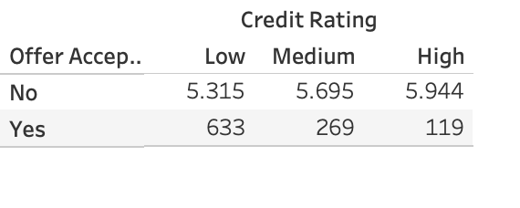

 **Question 8**:
 
 Based on the average balance for each customer, create four buckets : Category A, Category B, Category C, and Category D. Conduct a further deep dive into each of the categories and identify the possible trends

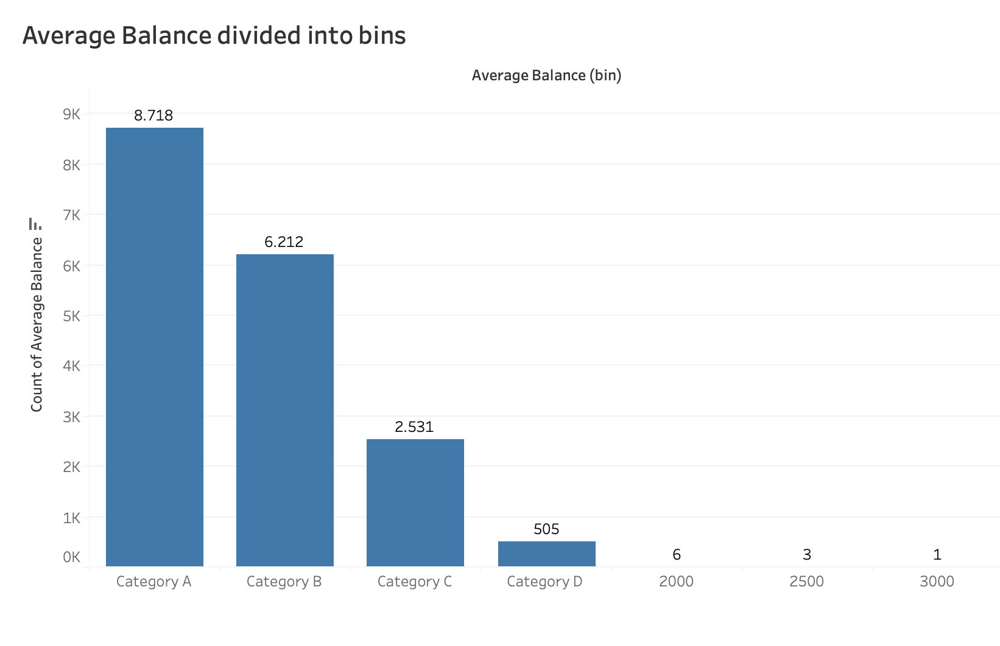

**Output**:

I divided Average Balance into 4 bins with bin size 500.Now we can see that there are 8718 customers with average balance between 0-500,6212 customers between 500-1000,2531 customers between 1000-1500 and 505 customers between 1500-2000.
6 customers with average balance 2000-2500,3 customers between 2500-3000 and 1 customer between 2500-3000 are outliers,so i will filter them

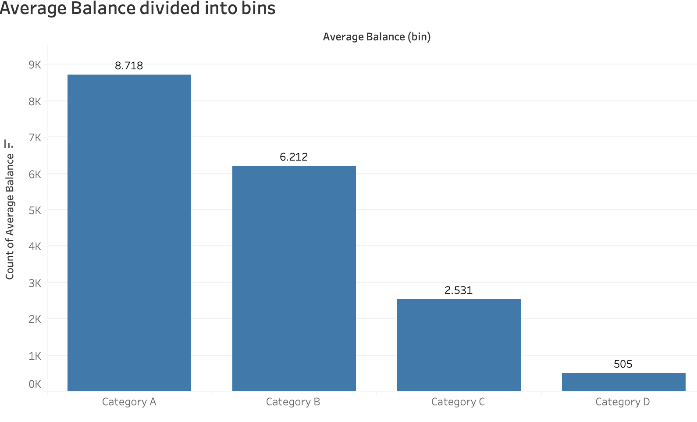

**Diving deep into data**:

In order to know  which factors play a role  on customers accepting the offer,i created Acceptance Rate variable as follows:

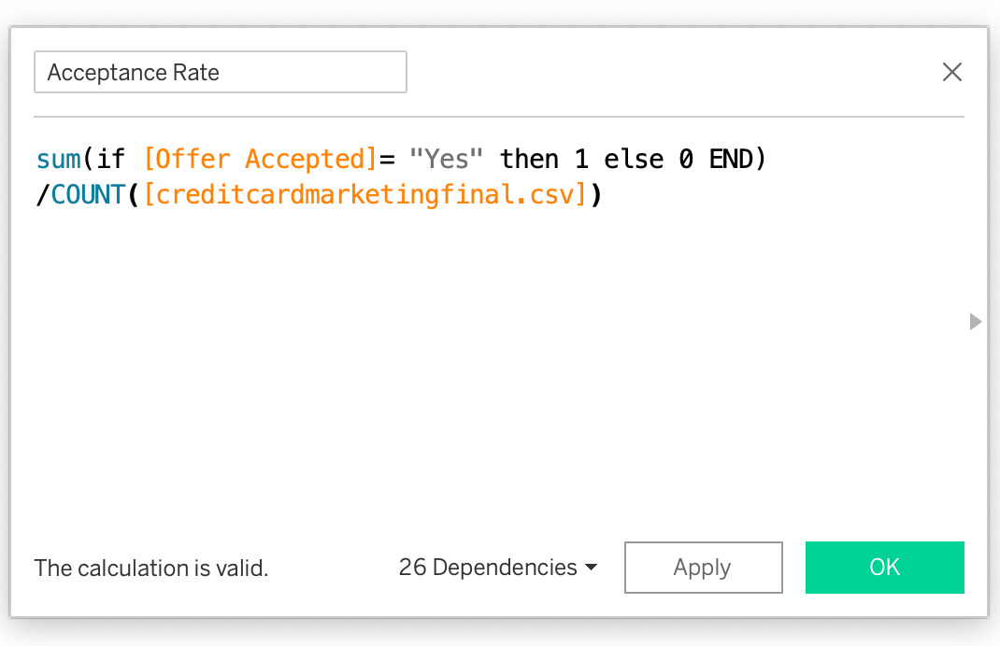

Now looking at the relationship of acceptance Rate with other columns,i can get useful information,how much each factor influence acceptance rate

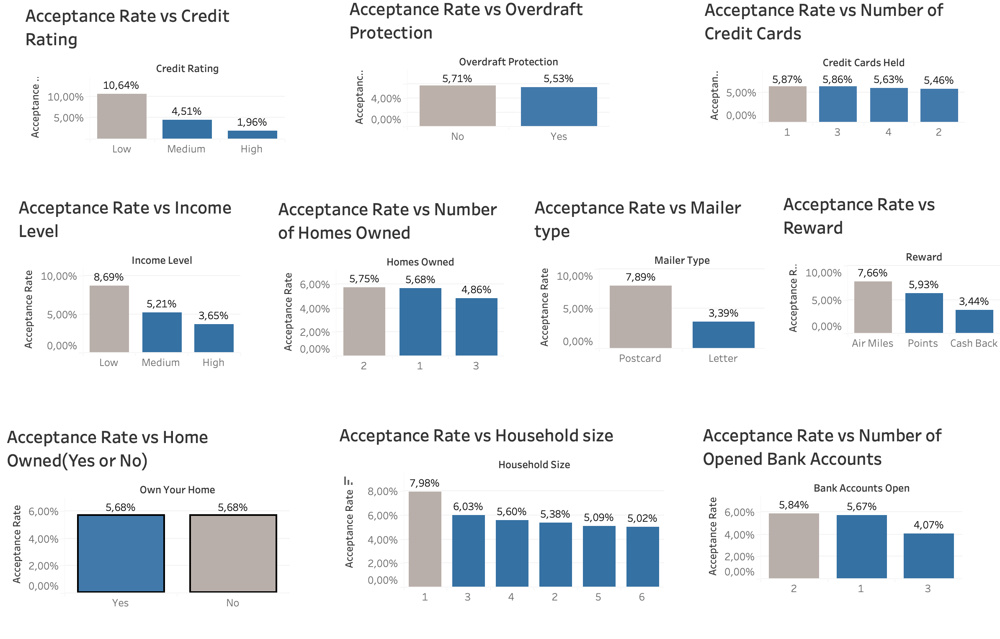

What I see from this plots is that, Acceptance Rate has negative correlation with Income level, Credit Rating and Household size. Whether the customers own their own home or not, have no influence on acceptance rate. Although customers not having overdraft protection consist of only 17% of customers having overdraft protection, the acceptance percentage of first one is more(5.71% vs 5.53%). So it is obvious that we should be more interested in the customers with no overdraft protection. 

**Final Output**:

So as risk analyst,in the future i would focus on customers with following characteristics:

- Customers with low credit rating
- Customers with household size 1 or 3
- Customers with no overdraft protection
- Customers with low income level
- Customers having 1 or 2 homes
- Customers having 1 or 3 credit cards 
- Customers having 2 accounts in bank
- Postcard sendings have much more acceptance rate.So in future it would be better to give more priority to use postcards on offers
- 

